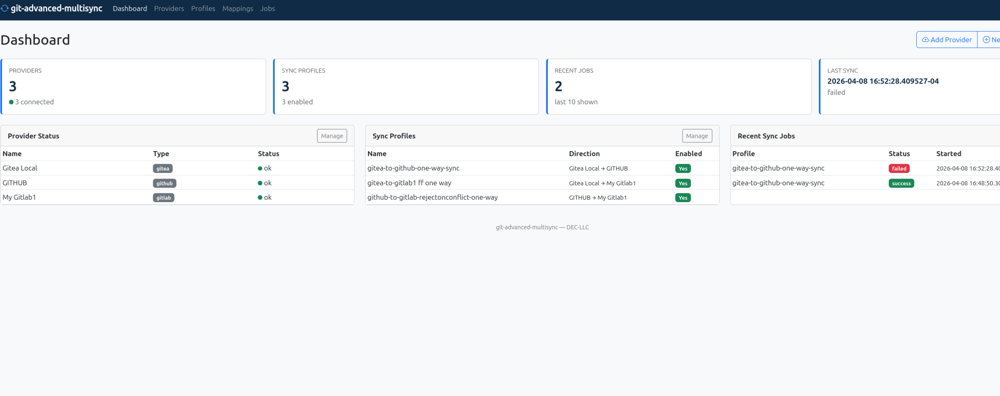
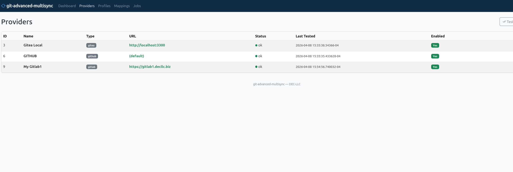
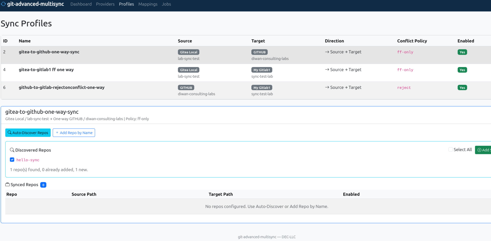
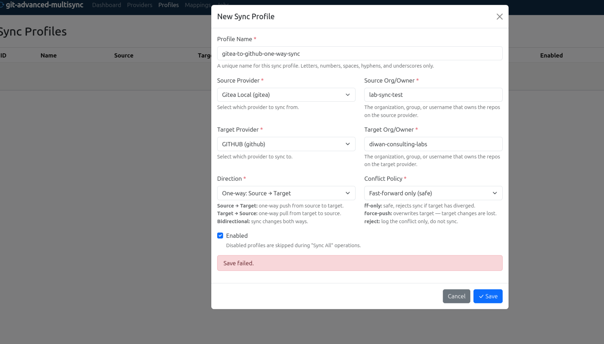
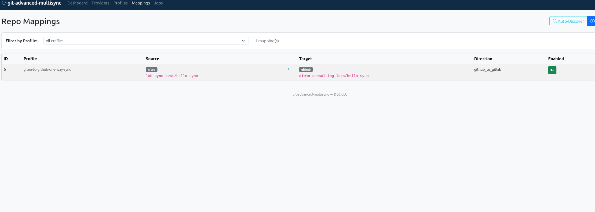
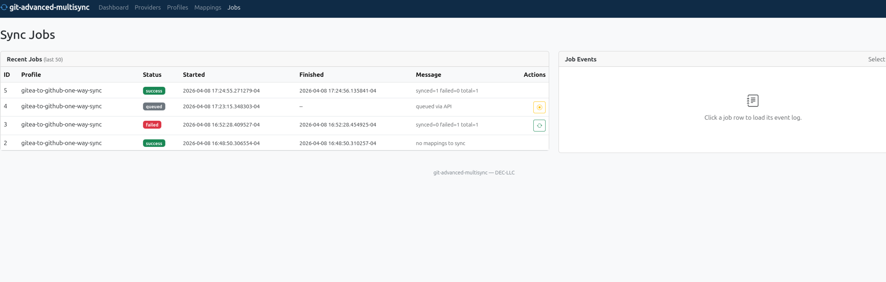

# git-advanced-multisync

**Keep your repositories in sync across GitHub, GitLab, and Gitea — from a single web interface.**

Most teams have repositories scattered across multiple Git hosting platforms. A mirror on GitHub for open source visibility, the real development on a self-hosted GitLab, a Gitea instance for the lab. Keeping them in sync means scripts, cron jobs, SSH keys, and hoping nobody forgets to push to the other remote.

git-advanced-multisync replaces all of that with a web UI. Add your providers, define sync profiles, map your repos, and click Sync. One-way mirrors, bidirectional sync, conflict detection — all configured from your browser. No scripts. No cron. No "which remote did I push to?"

## What it does

- **Multi-provider support** — GitHub, GitLab (self-hosted or cloud), and Gitea. Connect as many instances as you need.
- **Web-based configuration** — Add providers, create sync profiles, map repositories, trigger syncs, and view logs — all from the browser. No config files to edit.
- **Flexible sync profiles** — One-way push, one-way pull, or bidirectional. Multiple profiles between the same providers for different policies (e.g., a safe ff-only profile and a force-push mirror profile for the same pair).
- **Scheduled sync** — Per-profile intervals from 5 minutes to 24 hours with staggered start times to avoid thundering herd. Set it and forget it.
- **Conflict detection and enforcement** — Fast-forward-only (per-branch checks on protected branches), force-push (`--mirror --force`), or reject-and-log (divergence check before any push). Policies are enforced, not advisory.
- **Auto-discovery** — Discover repos from a provider's org/group and select which ones to sync. No manual typing of every repo name.
- **Duplicate prevention** — Same repo pair blocked across profiles. Reverse-direction mapping (target-to-source) also blocked to prevent sync loops.
- **RBAC** — Login page with admin and read-only roles. Admins manage providers, profiles, and syncs. Read-only users view status, jobs, and logs.
- **Sync locking** — Concurrent syncs of the same profile are prevented. Stale locks auto-expire after 30 minutes.
- **Retry logic** — Clone and push operations retry up to 3 times with exponential backoff (2s, 4s, 6s).
- **System status page** — Daemon uptime, worker status, next scheduled syncs, DB/workdir size, user list, recent job history — all at `/status`.
- **SSH and HTTPS transport** — Per-provider clone and push protocol selection. SSH key path stored in DB for SSH-based sync.
- **Job history and logs** — Every sync run is logged with per-repo event details. See what synced, what failed, and why.
- **REST API** — Everything the UI does is available via JSON API for automation and integration.

## Screenshots

### Dashboard

*At-a-glance view: 3 providers connected, 3 sync profiles, recent job history.*

### Providers

*Three providers configured and tested: Gitea (local), GitHub, GitLab. Green status = connected.*

### Sync Profiles with Repo Discovery

*Click a profile to manage its repos. Auto-discover finds repos from the source provider.*

### Create Profile

*Profile form with source/target providers, direction, conflict policy, and help text.*

### Repo Mappings (Audit View)

*Read-only view of all repo mappings across profiles. Source and target paths shown.*

### Sync Jobs

*Job history with status badges. Click a job to view its event log.*

## Quick Start

### Prerequisites

- Perl 5.26+ with Mojolicious, DBI, DBD::Pg
- PostgreSQL 12+
- Git

### Install and run (from source)

```bash
git clone https://github.com/DEC-LLC/git-advanced-multisync.git
cd git-advanced-multisync

# Install Perl dependencies
cpanm --installdeps .

# Create database
createdb gitmsyncd
psql -d gitmsyncd -f db/schema.sql

# Start the server
GITMSYNCD_DSN='dbi:Pg:dbname=gitmsyncd;host=127.0.0.1;port=5432' \
GITMSYNCD_DB_USER='gitmsyncd' \
GITMSYNCD_DB_PASS='gitmsyncd' \
  perl bin/gitmsyncd.pl
```

Open `http://localhost:9097` and log in with the default credentials: **admin / admin**.

### First steps

1. **Log in** — Default credentials are `admin` / `admin`. Change the password after first login.
2. **Add Providers** — Connect your GitHub, GitLab, or Gitea instances with an API token
3. **Create a Sync Profile** — Pick a source and target provider, choose a direction, conflict policy, and optional schedule
4. **Map Repos** — Auto-discover repos from the source org or add them manually
5. **Sync** — Click "Sync Now" and watch the job log, or let the schedule handle it
6. **Monitor** — Visit `/status` for system health: daemon uptime, next scheduled syncs, DB size, recent jobs

## Sync Profiles

A sync profile defines a relationship between two provider orgs. You can create **multiple profiles** between the same pair of providers — for example:

| Profile | Direction | Policy | Use case |
|---------|-----------|--------|----------|
| `gitlab-to-github-mirror` | One-way | force-push | Authoritative mirror to GitHub |
| `gitlab-to-github-safe` | One-way | ff-only | Safe sync that rejects if diverged |
| `gitlab-github-bidi` | Bidirectional | ff-only | Two-way sync for collaborative repos |

The profile name is the unique identifier, not the provider pair. Use as many as you need.

Each profile can have an optional **schedule** (5 minutes to 24 hours). Scheduled profiles are processed by the background worker with staggered start times to avoid all profiles syncing at the same instant.

## Supported Providers

| Provider | Hosting | How it connects |
|----------|---------|-----------------|
| **GitHub** | Cloud (github.com) | API token via api.github.com |
| **GitLab** | Self-hosted or cloud | API token via your instance URL |
| **Gitea** | Self-hosted | API token via your instance URL |

## Sync Directions

| Direction | Behavior |
|-----------|----------|
| **Source to Target** | One-way push. Source is authoritative. |
| **Target to Source** | One-way pull. Target is authoritative. |
| **Bidirectional** | Changes sync both ways. Conflicts detected. |

## Conflict Policies

These policies are **enforced at sync time**, not advisory. The sync engine checks divergence before pushing.

| Policy | Behavior | Implementation | When to use |
|--------|----------|----------------|-------------|
| **ff-only** | Skips diverged protected branches, syncs the rest | Fetches target refs, runs `merge-base --is-ancestor` on each protected branch, builds per-branch refspecs instead of `--mirror` | Safe default for most workflows |
| **force-push** | Overwrites target with source state | `git push --mirror --force` — source is authoritative | One-way mirrors where source is authoritative |
| **reject** | Checks all branches for divergence, skips entire repo if any diverged | Fetches target refs, checks every branch with `merge-base`, refuses to push if any conflict found | Monitoring mode — detect drift without acting |

## Documentation

- [User Guide](docs/USER-GUIDE.md) — Full walkthrough with UX diagrams and test matrix
- [Architecture](docs/ARCHITECTURE-ALPHA-200.md) — Technical design and data model

## Installation

### RPM (Rocky/RHEL/Fedora)

```bash
rpm -ivh git-advanced-multisync-0.2.0-1.el10.noarch.rpm

# Configure
vim /etc/gitmsyncd/gitmsyncd.env

# Create database and start
createdb gitmsyncd
psql -d gitmsyncd -f /usr/share/gitmsyncd/schema.sql
systemctl enable --now gitmsyncd
```

### DEB (Debian/Ubuntu)

```bash
dpkg -i git-advanced-multisync_0.2.0-1_all.deb

# Configure
vim /etc/gitmsyncd/gitmsyncd.env

# Create database and start
createdb gitmsyncd
psql -d gitmsyncd -f /usr/share/gitmsyncd/schema.sql
systemctl enable --now gitmsyncd
```

## Security

- **Session-based authentication** — All routes (except `/api/health` and `/login`) require an active session. API requests without a session receive `401 Unauthorized`.
- **Role enforcement** — Admin and read-only roles. Write operations (creating providers, profiles, triggering syncs) require admin role. Violations return `403 Forbidden`.
- **Default credentials** — `admin` / `admin`. Should be changed immediately after first login.
- **Token storage** — API tokens are stored in PostgreSQL in plain text. Encrypted storage is on the roadmap.
- **Token masking** — Tokens are never displayed in the UI after entry. Only the last 4 characters are shown.
- **Sync locking** — Concurrent syncs of the same profile are prevented via database locks. Stale locks auto-expire after 30 minutes.
- **HTTPS transport** — All provider API calls and git clone/push operations use HTTPS by default. SSH transport available per-provider.

## API

All UI operations are available via REST API. All endpoints except `/api/health` require session authentication.

```bash
# Health check (no auth required)
curl http://localhost:9097/api/health

# Log in (stores session cookie)
curl -c cookies.txt -X POST http://localhost:9097/login \
  -d 'username=admin&password=admin'

# List providers
curl -b cookies.txt http://localhost:9097/api/providers

# Add a provider
curl -b cookies.txt -X POST http://localhost:9097/api/providers \
  -H 'Content-Type: application/json' \
  -d '{"name":"My GitLab","provider_type":"gitlab","base_url":"https://gitlab.example.com","api_token":"glpat-xxx"}'

# Test a provider connection
curl -b cookies.txt -X POST http://localhost:9097/api/providers/1/test

# Discover repos in an org
curl -b cookies.txt http://localhost:9097/api/providers/1/repos?owner=my-org

# Queue a sync (processed by background worker)
curl -b cookies.txt -X POST http://localhost:9097/api/sync/start/1

# Run a sync immediately (synchronous, returns results)
curl -b cookies.txt -X POST http://localhost:9097/api/sync/run/1

# Stop a queued/running job
curl -b cookies.txt -X POST http://localhost:9097/api/sync/stop/42

# List sync jobs
curl -b cookies.txt http://localhost:9097/api/sync/jobs?limit=10

# Get job details with events
curl -b cookies.txt http://localhost:9097/api/sync/jobs/3
```

## Roadmap

- [x] **Authentication and RBAC** — Login page with admin and read-only user roles. Admins can add providers, create profiles, and trigger syncs. Read-only users can view status, jobs, and logs.
- [x] **Scheduled sync** — Per-profile intervals (5 min to 24 hr) with stagger. Background worker processes due profiles automatically.
- [x] **System status page** — Daemon uptime, worker status, next scheduled syncs, DB health, disk usage on workdir. Available at `/status`.
- [x] **Sync locking** — Concurrent sync prevention with stale lock timeout (30 min).
- [x] **Duplicate mapping prevention** — Same pair and reverse-direction pair blocked across all profiles.
- [x] **Retry logic** — Clone and push operations retry up to 3 times with exponential backoff.
- [x] **SSH transport** — Per-provider clone/push protocol selection with SSH key path support.
- [x] **Conflict policy enforcement** — ff-only does per-branch checks on protected branches, force-push does `--mirror --force`, reject checks divergence before any push.
- [x] **RPM and DEB packaging** — systemd service, env file, schema bundled.
- [ ] **Chained sync** — Sync a repo across three or more providers in sequence (e.g., GitLab -> GitHub -> Gitea) in a single profile, with per-hop conflict policies.
- [ ] **Custom provider support** — Add any Git hosting platform that speaks a standard API. Define the API endpoint patterns (repos list, clone URL format, auth header) and use it alongside the built-in GitHub/GitLab/Gitea adapters.
- [ ] **Webhook triggers** — Receive push webhooks from providers and sync immediately on change instead of polling.
- [ ] **Diff preview** — Before syncing, show what commits would be pushed and flag potential conflicts.
- [ ] **Issue and PR/MR sync** — Synchronize issues, pull requests, and merge requests across providers. Map labels, milestones, assignees, and comments between GitHub Issues/PRs, GitLab Issues/MRs, and Gitea Issues/PRs. Bidirectional with loop prevention so a synced comment doesn't bounce back as a duplicate.
- [ ] **SSH key trust terminal** — One-time interactive SSH session through the web UI to accept host keys for SSH-based sync. Secure WebSocket terminal, used once per provider, then trusted forever.
- [ ] **Windows support** — Perl runs on Windows via Strawberry Perl or WSL. Package as a portable Windows distribution with bundled dependencies.
- [ ] **TLS/HTTPS** — Native TLS support with user-provided certificates. Serve the web UI over HTTPS without a reverse proxy.
- [ ] **Forced password change** — First admin login requires password change. Admin can also force password reset for any user.
- [ ] **Encrypted token storage** — API tokens currently stored in plain text. Encrypt at rest with application-level key.
- [ ] **Split architecture for Windows** — Separate web UI process and sync engine process. Start/stop/restart controls in the UI. Required for Windows support where systemd doesn't exist.

## License

Dual-licensed under MIT and GPLv3. See [LICENSE](Legal/) files for details.

## About

Built by [Diwan Enterprise Consulting LLC (DEC-LLC)](https://dec-llc.biz). Part of the DEC-LLC open source initiative.

We build infrastructure management software: [NIVMIA](https://dec-llc.biz/products/nivmia.html) (network), [IVMIA](https://dec-llc.biz/products/ivmia.html) (virtualization), [OpenUTM](https://dec-llc.biz/products/openutm.html) (security), [VaultSync](https://dec-llc.biz/products/vaultsync.html) (backup). git-advanced-multisync keeps our own repos in sync across GitHub and GitLab — and now it can do the same for yours.
